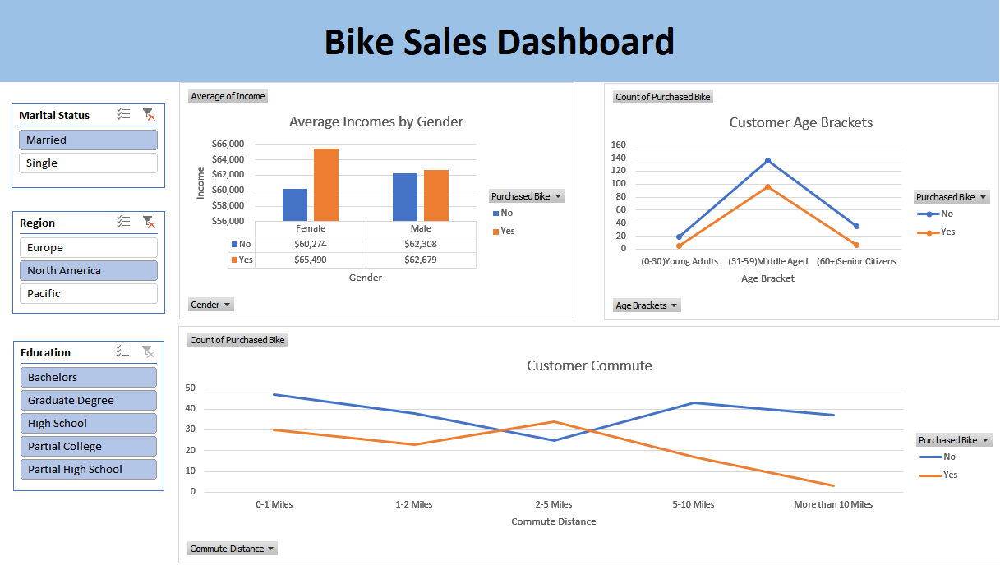
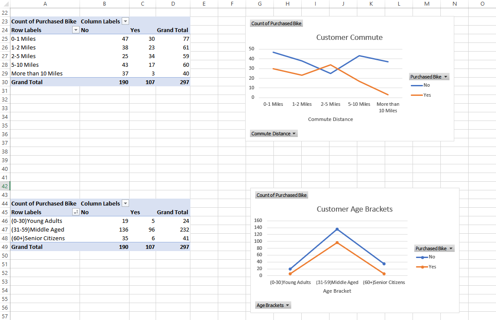
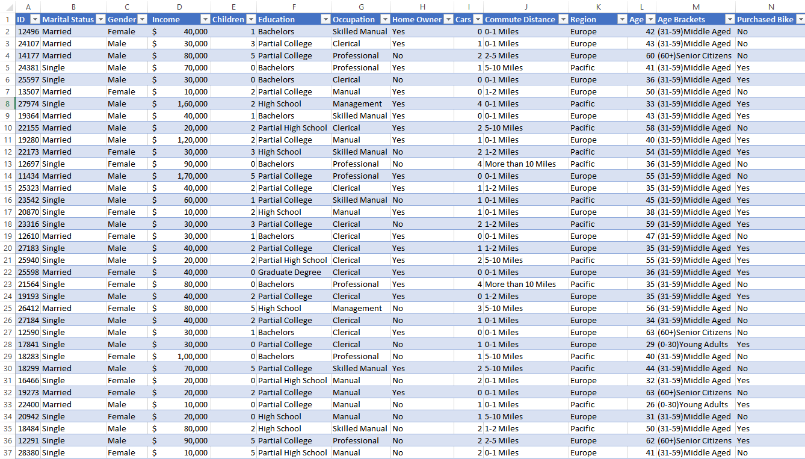

# 🚴‍♂️ Bike Sales Dashboard (Excel)

This project analyzes bike sales data for a given fiscal year, exploring how various factors such as **age**, **gender**, and **commuting distance** influence purchasing behavior.

The dashboard is built using **Microsoft Excel** and includes several **interactive slicers** to dynamically filter and drill down into the data for more effective analysis.

---

## 📊 Key Features

- 📅 Analysis of bike purchases  
- 🧍 Demographic breakdown by age and gender  
- 🚲 Impact of commute distance on buying trends  
- 📎 Slicers for region, marital status, level of education  
- 📈 Dynamic charts for insights at a glance  

---

## 🖼️ Screenshots

### Dashboard Overview

### Pivot Tables

### Table Overview

---

## 📁 Files Included

- `bike_sales_dashboard.xlsx` — The complete Excel dashboard file  
- `Dashboard_Screenshot.png` — Visual preview of the dashboard
- 'Pivot-Tables_Screenshot.png' — Pivot Tables preview
- 'Table-Screenshot.png' — Table overview

---

## 🛠️ Tools Used

- Pivot Tables  
- Slicers  
- Charts
- Data Cleaning & Transformation

---

## 📥 How to Use

1. Download the `.xlsx` file from this folder.  
2. Open it in Microsoft Excel (2016 or later recommended).  
3. Use the slicers to explore trends and filter insights based on your needs.

---

Feel free to explore, modify, or extend this dashboard for your own analytical purposes!

