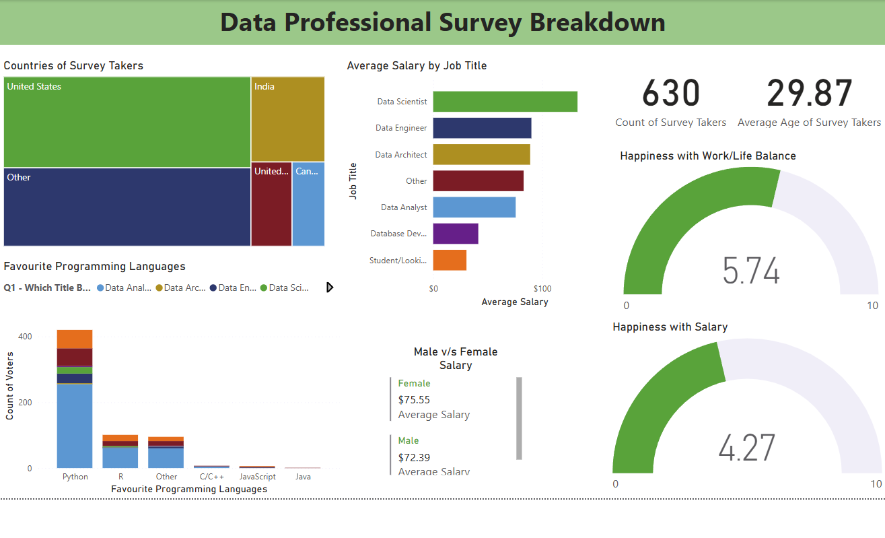

# 📈 Data Professionals Breakdown (Power BI)

This interactive Power BI dashboard explores insights about various types of **data professionals**—including **data analysts**, **data scientists**, **data engineers**, and others.

The dashboard helps visualize and compare **salary trends**, **gender representation**, and **geographic distribution** across different roles in the data industry.

---

## 📊 Key Questions Answered

- How do salaries vary across different data roles and countries?  
- Is there a gender pay gap within specific professions?  
- What is the representation of data professionals across regions?

---

## 🧠 Features & Visuals Used

- **Interactive slicers** 
- **Gauge charts** 
- **Treemaps** 
- **Bar and column charts** 
- **Card visuals**

---

## 📸 Screenshot

### 📈 Report Screenshot

---

## 🗂️ Files Included

- `data_professionals_dashboard.pbix` — Power BI dashboard file  
- `README.md` — Project overview and screenshots  
- Dashboard image preview (`*.png`) for quick insights

---

## 🌐 How to View the Dashboard

You can view the report in two ways:

1. **Download and open the `.pbix` file** using Power BI Desktop  
2. **[Click here to view the interactive Power BI dashboard](https://app.powerbi.com/view?r=eyJrIjoiM2U4OWFjZWYtZjc5Zi00ZjRlLWI4MDUtNzUzOGJhM2UwMTk5IiwidCI6IjUyNWZlZmE4LWFhZGItNDhiOS04ZGI1LWQxNjA3YjQ0YTY3OSJ9&embedImagePlaceholder=true)**
   
---

## 🛠️ Tools Used

- Power BI Desktop  

---
