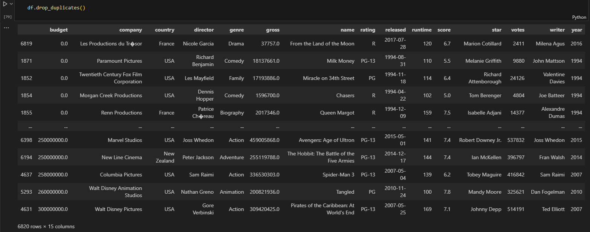
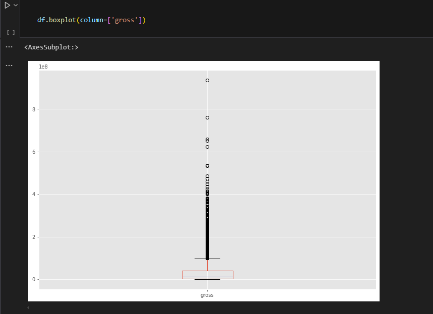
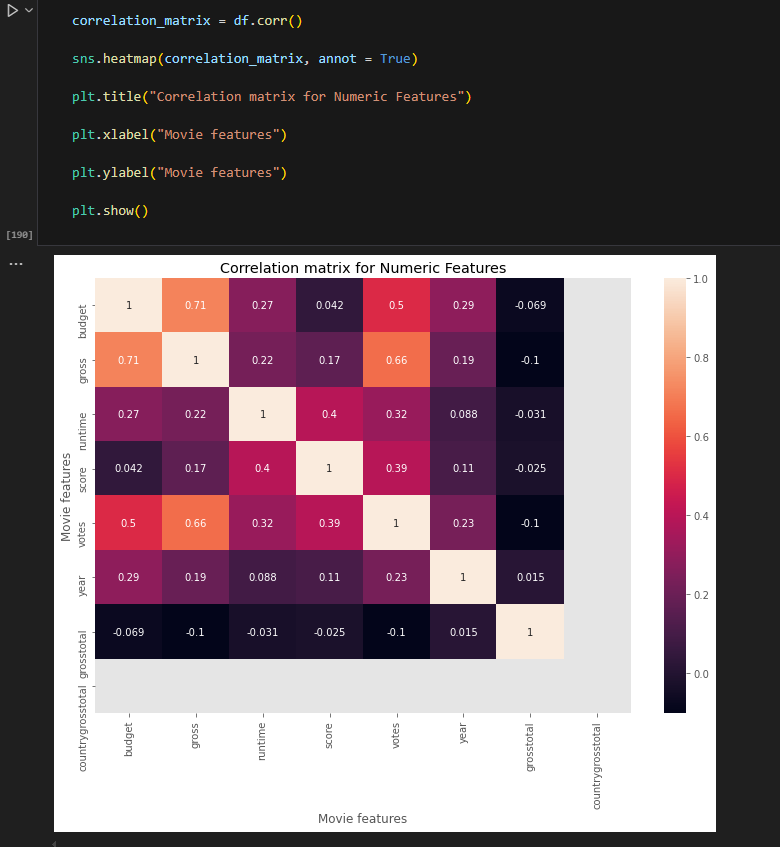
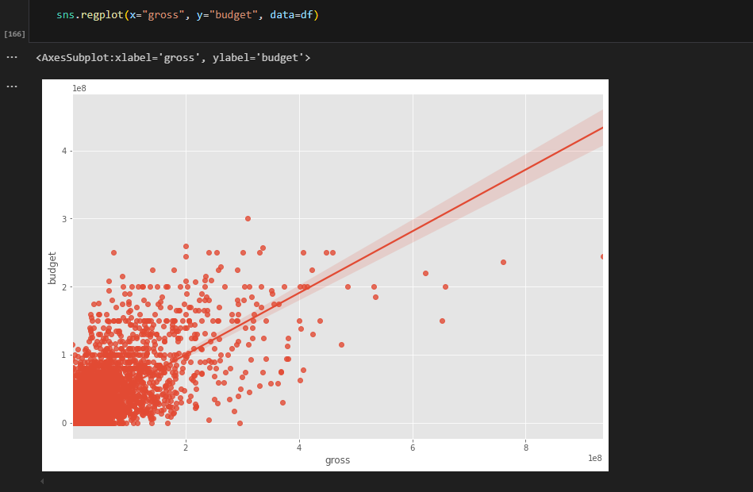

# 🎬 Movies Dataset – Data Exploration (Python)

This project performs a detailed exploratory data analysis (EDA) on a movies dataset using Python. It involves inspecting, cleaning, and visualizing data to understand trends, correlations, and patterns within the film industry.

The goal is to demonstrate core data analysis skills using popular Python libraries and turn raw movie-related data into meaningful insights.

---

## 🔍 Key Tasks Performed

- Initial data inspection and structure review  
- Detection and removal of null/missing values  
- Data cleaning and preparation for analysis  
- Correlation matrix and heatmap generation  
- Visualizations using bar charts, histograms, scatter plots, and more

---

## 🧠 Tools & Libraries Used

- `pandas` — for data manipulation and analysis  
- `numpy` — for numerical operations  
- `matplotlib` — for plotting and visualizations  
- `seaborn` — for statistical visualizations and heatmaps

---

## 📸 Screenshots

### 🧾 Dropping Duplicates

### 🧼 Outlier Detection

### 📊 Correlation Heatmap After Cleaning

### 🎞️ RegPlot

---

## 🗂️ Files Included

- `movies_data_exploration.ipynb` — Jupyter notebook with full EDA  
- `movies.csv` — Dataset used for exploration  
- `README.md` — Project documentation  
- Screenshot images (`*.png`) for previewing key outputs

---

## 🛠️ How to Run

1. Clone or download this repository  
2. Open `movies_data_exploration.ipynb` using Jupyter Notebook  
3. Run cells sequentially to see data cleaning, analysis, and visualizations  
4. Ensure required libraries (`pandas`, `numpy`, `matplotlib`, `seaborn`) are installed

---
